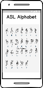
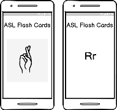
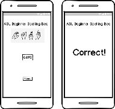
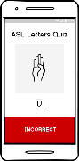
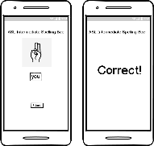
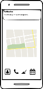

# ASL Fingerspelling Bee

## Overview

ASL Fingerspelling Bee is an American Sign Language (ASL) fingerspelling reference and practice app. It is intended to be used as a tool to learn and practice the American Manual Alphabet through the use of flash cards and quizzes.

It can be difficult for ASL learners to find resources that clearly depict the manual letters. ASL Fingerspelling Bee is intended to provide clear, easy-to-follow graphics to teach users the manual signs for each letter. Some learners are also limited in their exposure to other signers, limiting their ability to develop and practice their receptive language skills in fingerspelling. Another obstacle to learning is that beginning learners often find the speed at which fluent ASL signers fingerspell make it difficult to practice comprehension (Kemp, 1998). This app utilizes flash cards and quizzes to provide an opportunity for users to practice their reading abilities and to test their comprehension using static images of manual letters.

Potential users of this application would be beginning ASL learners of all ages and those who wish to practice their receptive skills of the American Manual Alphabet.  It would also be used by ASL teachers, who will use it as a reference guide and learning reinforcement tool for students inside and outside of the classroom.  It is expected that learner users of this app may be hearing or Deaf.

## Related Work

There are several American Manual Alphabet/fingerspelling-focused apps in the Google Play store.  Some of the apps were poorly maintained and were too glitchy to use, with other users describing similar experiences in their reviews of them in the app store. I tried every related free app, several of which provided more insight for the development of my app.

The ASL Fingerspelling Alphabet by Teachers Paradise Studios focused on providing flashcards for the manual signs with sounds and tasking users to trace the written capital and lowercase English letters underneath the corresponding signs (see Figure 2.1). The manual signs are shown using a photo of a light-skinned hand demonstrating each letter sign. ASL Fingerspelling Bee will utilize black and white graphics depicting each hand sign to provide a more inclusive demonstration for learners of all skin tones. It will also omit the use of sounds to demonstrate the pronunciation of each letter because Deaf learners would not benefit from this feature and it reduces resources devoted to a feature that would not benefit all learners.

Figure 2.1: “ABC Trace” in ASL Fingerspelling Alphabet app

ASL Fingerspelling by Sefol UG focuses on a single timed quiz activity, which automatically begins a few seconds after opening the app, even if the user doesn’t touch the “Start” button.  It displays a black-and-white photo of 1-3 manual signs with their corresponding English letter underneath and alternates these with quiz questions that display a photo of previously shown manual letter, tasking the user to select the correct English letter from three letter choices beneath it (see Figure 2.2).  The user is informed of a correct choice when the next screen displays the text “Yes!” at the top and a wrong answer with a screen that says “Sorry. Wrong.” and displays the correct letter underneath the photo. It provides a running summary of the user’s score over the entire history of the app. ASL Fingerspelling Bee will provide a similar quiz functionality as one of its features but it will be separate from the learning flashcards and users must choose this activity from a menu.

 

Figure 2.2: ASL Fingerspelling app

AJM13’s Learn ASL Fingerspelling would be the closest to ASL Fingerspelling Bee in functionality.  It utilizes blue and white graphics to depict each letter of the American Manual Alphabet and provides a chart of the alphabet, flash cards of the signs (see Figure 2.3), a “Sign Test” that asks users to identify the English letter from its corresponding manual sign, a “Letter Test” that asks users to select the sign for the English letter being shown, and a “Name Test” that asks users to type a name from signs being shown one at a time. ASL Fingerspelling Bee will provide similar features, as well as additional features to build receptive language skills such as spelling quizzes for beginners that show static images of fingerspelled words.

Figure 2.3: A-Z Signs in the Learn ASL Fingerspelling app

## Proposed High level Requirements

### Essential Features: 

1. **Title**: ASL Alphabet Reference Chart

**Description**: As a user, I want to see the entire ASL alphabet in one place with their corresponding letters, so I have a quick reference.

**Acceptance Tests**: The screen will display a chart containing graphics for each letter in the American Manual Alphabet with its corresponding English letter underneath.

2. **Title**: ASL Alphabet Flashcards

**Description**: As a user, I want to have flash cards that allow me to practice testing myself on identifying the English letter for each ASL manual letter, so I can improve my receptive ASL fingerspelling skills.

**Acceptance Tests**: The ASL Alphabet Flash Cards will display a sign on the screen and will display the corresponding letter upon the user touching the screen.

3. **Title**: ASL Beginner Spelling Bee

**Description**: As a user, I want to test my ability to read words spelled in the ASL manual alphabet, so I can practice my receptive ASL fingerspelling skills.

**Acceptance Tests**: The ASL Beginner Spelling Bee will display a short word at the top of the page using graphics of manual hand signs.  The user will enter the corresponding English words and click submit.  Upon clicking submit, the app will display whether the user’s answer was correct or incorrect.

4. **Title**: ASL Letter Quiz

**Description**: As a user, I want to test my ability to recognize an English letter from its ASL manual letter, so I can properly interpret fingerspelled words.

**Acceptance Tests**: The ASL Letter Quiz will display a graphic of a manual sign at the top of the page.  The user will enter the corresponding English letter and click submit.  Upon clicking submit, the app will display whether the user’s answer was correct or incorrect.

5. **Title**: Main Menu/Simple Layout

**Description**: As a user, I want a graphical menu, so I can easily access the activities I want.

**Acceptance Tests**: The Main Menu will provide a simple graphical interface for the user to choose their desired activity.

### Desirable Features

1.	**Title**: Reverse Flash Cards

**Description**: As a user, I want to have flash cards that allow me to test myself on identifying the ASL manual letter that corresponds with the  English letter show, so I can practice my receptive ASL fingerspelling skills.

**Acceptance Tests**: The screen will display an English letter and will display the corresponding manual letter upon the user touching the screen.

2. **Title**: Shake to Shuffle Flash Cards

**Description**: As a user, I want to be able to shuffle the flash cards
by shaking the phone, so I can easily change the order of the cards to
make it more challenging.

   **Acceptance Tests**: When the user shakes the phone, the flash cards
   will be shuffled. The user touching the screen to proceed to the next
   card will result in a random card being shown instead of only the
   card that follows in the English alphabet.

3. **Title**: ASL Intermediate Spelling Bee

**Description**: As a user, I want to test my ability to read words fingerspelled one letter at a time, so I can improve my ability to interpret fingerspelled words.

**Acceptance Tests**: The ASL Intermediate Spelling Bee will display a short English word at the top of the page using graphics of manual hand signs, one letter at a time (like a slideshow).  The user will enter the corresponding English letters of the word and click submit.  Upon clicking submit, the app will display whether the user’s answer was correct or incorrect.

4.	**Title**: Practice Reminder Notification

**Description**: As a user, I want to be reminded when I haven’t practiced recently, so I study more consistently and effectively.  Notifications have been shown to increase quick learning sessions that are effective for microlearning of languages (Dingler, et al., 2017).

**Acceptance Tests**: A push notification will be sent when the user hasn’t opened the ASL Fingerspelling Bee app in the last 48 hours.

### Optional Features

1. **Title**:  Score Tracking

**Description**: As a user, I want to be able to see a history of my accuracy with each activity, so I can track my performance over time.

2. **Title**:  Add Numbers
Description: As a user, I want to be able to study ASL number signs, so I can learn to sign number in ASL.

3. **Title**:  ASL Manual Alphabet Quiz
Description: As a user, I want to be able to select an ASL manual letter to correspond with a displayed English letter, so I can practice discerning between signs.

4. **Title**:  Hangman Game

**Description**: As a user, I want to play a game of Hangman using an American Manual Alphabet keyboard, to practice my expressive ASL fingerspelling skills in a fun way.

5. **Title**: Advanced Spelling Bee

**Description**: As a user, I want to practice interpreting fingerspelling
from real hands signing, so I can advance my fingerspelling interpreting
on scenarios that mimic real-world circumstances.

## Android Components and Features To Be Used

ASL Fingerspelling Bee will utilize the following Android components and features:

•	Android UI Layouts: Android UI layouts will be used to design the UI for all of the app’s features.

•	Android Graphics: Android Graphics will be used in designing the look of the app and displaying the appropriate graphics of the American Manual Alphabet.

•	Touch Device: The touch screen sensor will be used to implement virtual keys and to control the navigation and usage of ASL Fingerspelling Bee’s features.

•	Notifications: Notifications will be used to push a notification to a user to remind them to practice their fingerspelling skills if they have not used the app for more than 48 	hours.

•	Accelerometer: The accelerometer motion sensor will be used to detect shaking for the flash card shuffle feature.

•	SQLite Database: An SQLite database will be used to track user’s scores over time.

## Timeline

*(Please provide a detailed plan/description to specify when the above requirements and android features will be/are implemented. This should be updated in every iteration.)*

| Iteration | Application Requirements (E/D/O)                                                           | Android Components and Features                                     |
|:----------|:-------------------------------------------------------------------------------------------|:--------------------------------------------------------------------|
| 1         | Main Menu/Simple Layout; ASL Alphabet Reference Chart                                      | Android UI Layouts, Android Graphics, Touch Device                  |
| 2         | ASL Alphabet Flashcards; ASL Beginner Spelling Bee                                         | Android UI Layouts, Android Graphics, Touch Device                  |
| 3         | ASL Letter Quiz; Reverse Flashcards; Shake to Shuffle Flashcards                           | Android UI Layouts, Android Graphics, Touch Device, Accelerometer   |
| 4         | ASL Intermediate Spelling Bee; Practice Reminder Notification                              | Android UI Layouts, Android Graphics, Touch Device, Notifications   |
| 5         | Score Tracking; Add Numbers; ASL Manual Alphabet Quiz; Hangman Game; Advanced Spelling Bee | Android UI Layouts, Android Graphics, Touch Device, SQLite Database |

## Requirement Analysis and Testing 

*(In Iteration 1-5, for each requirement you have worked on in this iteration, please give a detailed description, completion status (completed, or partially completed) and show the testing results if completed or partially completed, such as screenshots of the application screens or log info.) Please also specify if this requirement is a new requirement or a requirement you had started in previous iterations. Please also specify what device do you use for testing )*

## Design and Implementation

*(In Iteration 1-5, please describe Android components and features you have used in this iteration to implement the above requirements in your application. For each feature you used, provide a brief description and supporting evidences, such as sample code, log info, or screenshot(s) of execution results. Please specify mapped requirements and files in your project.)*

## Project Structure
*(In Iteration 1-5, please provide a screenshot of your project structure, and describe what files are modified, added or deleted since the previous iteration.)*

## References

Dingler, T., Weber, D., Pielot, M., Cooper, J., Chung-Cheng, C., & Henze, N. (2017). Language Learning On-The-Go: Opportune Moments and Design of Mobile Microlearning Sessions. MobileHCI '17: Proceedings of the 19th International Conference on Human-Computer Interaction with Mobile Devices and Services (pp. 1-12). Vienna, Austria: Association for Computing Machinery.

Kemp, M. (1998). Why is Learning American Sign Language a Challenge? American Annals of the Deaf, 255-259.

